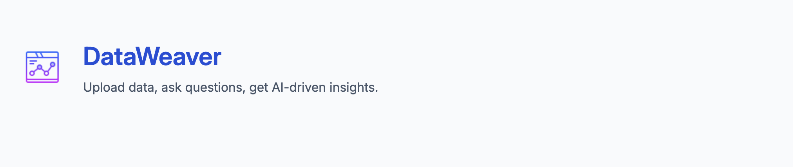
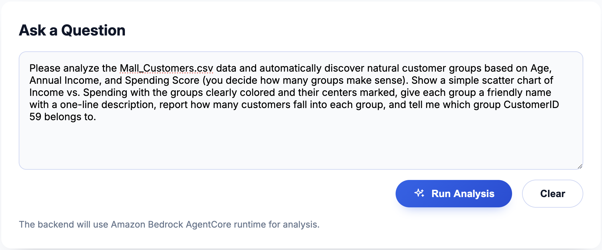
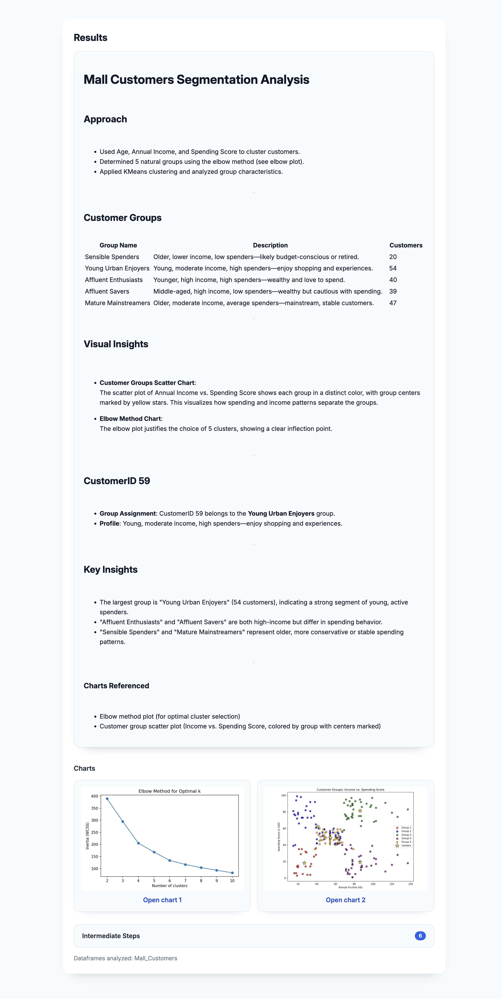
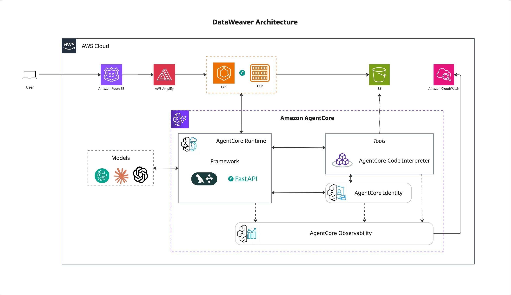

# DataWeaver

DataWeaver is a FastAPI service and Vue UI that sit between Amazon Bedrock AgentCore and business users. Upload tabular data to S3, ask a question, and the service coordinates Bedrock’s code-interpreter tools to deliver Markdown narratives and shareable charts.

## Key Features

- **Single data ingress** – `/upload` streams files to S3 and returns keyed URIs for analysis sessions.
- **Dual hosting model** – same container runs inside Bedrock Agent Runtime or in ECS as an API proxy.
- **Agent runtime orchestration** – LangChain `AgentExecutor` drives the Bedrock code interpreter to load data, run matplotlib, and save charts per session.
- **Polished responses** – results return as sanitized Markdown and chart URLs; the Vue front end renders headings, tables, and gallery cards.
- **Trace-friendly** – headers (`traceparent`, `X-Amzn-Bedrock-AgentCore-Runtime-Session-Id`, etc.) and payload overrides are preserved for OTEL.






## Architecture



## Repository Layout

- `server/` – FastAPI backend, Bedrock orchestration utilities, S3 loader, Streamlit helper.
- `ui/` – Vue 3 + Vite single page app (axios client, Markdown renderer, chart grid).
- `Dockerfile` – production image suitable for ECS or Bedrock Agent Runtime.
See [SETUP.md](SETUP.md) for detailed installation and deployment steps.

## Prerequisites

- Python 3.11+
- Node.js 18+ (for the UI)
- AWS account with Bedrock AgentCore access and S3 permissions
- `uv` for Python dependency management (optional but recommended)

## Backend Setup

```bash
# Install uv if needed
curl -LsSf https://astral.sh/uv/install.sh | sh

# Install Python dependencies
uv sync
```

Create `.env` in the repository root:

```bash
cp .env.example .env
```

Set the essentials (no static credentials required when using task roles):

```env
AWS_REGION=us-west-2
S3_BUCKET_NAME=your-artifact-bucket
BEDROCK_AGENT_RUNTIME_ARN=arn:aws:bedrock-agentcore:...
CODE_INTERPRETER_TOOL_ID=ci-xxxxxxxx
```

Run the API locally:

```bash
uv run uvicorn server.app:app --host 0.0.0.0 --port 8080
```

## Frontend Setup

```bash
cd ui
npm install
npm run dev
```

Configure the API base URL via `.env` or runtime global:

- build time: `VITE_API_BASE_URL=https://your-api.example.com`
- runtime: inject `window.__AGENT_CORE_API_BASE_URL`

For Markdown playground styling, set `VITE_MARKDOWN_PREVIEW=true` before starting `npm run dev`.

## API Surface

| Method | Path           | Description                                     |
|--------|----------------|-------------------------------------------------|
| GET    | `/ping`        | Health check                                    |
| POST   | `/upload`      | Multipart file upload → S3 URLs map             |
| POST   | `/invocations` | Bedrock-compatible data analysis endpoint       |
| POST   | `/chat`        | Proxy to Bedrock Agent Runtime (UI entry point) |

Example `/chat` request:

```bash
curl -X POST "$API_BASE/chat" \
  -H "Content-Type: application/json" \
  -H "X-Amzn-Bedrock-AgentCore-Runtime-Session-Id: session-1234" \
  -d '{
    "s3_urls": {
      "customers": "s3://your-bucket/uploads/customers.csv"
    },
    "prompt": "Generate a bar chart of customer count by country and summarise the top regions."
  }'
```

Successful responses include:

- `output` – Markdown narrative
- `intermediate_steps` – LangChain trace snippets
- `dataframes_loaded` – DataFrame keys hydrated from S3
- `charts` – Presigned URLs under `s3://bucket/charts/<runtimeSessionId>/`

## Observability Notes

- ADOT auto-instrumentation (`aws-opentelemetry-distro`) is installed; supply OTEL variables as needed.
- Trace headers from clients are echoed back under `trace.headers` and `trace.payload`.
- The agent prompt instructs Bedrock to avoid leaking session IDs; chart paths remain internal.

## Deployment

### Docker Build

```bash
docker build -t agentcore-dataweaver .
```

### ECS (API proxy)

1. Push image to ECR.
2. Configure task **execution role** for logging and **task role** with:
   - `bedrock-agentcore:InvokeAgentRuntime`
   - S3 read/write to the upload bucket
3. Provide environment variables (`BEDROCK_AGENT_RUNTIME_ARN`, `CODE_INTERPRETER_TOOL_ID`, etc.).
4. Expose port 8080 behind your load balancer.

### Bedrock Agent Runtime

1. Register the container image with Bedrock Agent Runtime.
2. Supply the same environment variables.
3. Bedrock invokes `/invocations` and `/ping`; `/chat` is unused in this mode.

## Available Scripts

- `uv run pytest` – backend smoke tests (see `server/tests`).
- `npm run dev` – UI development server.
- `npm run build` – production UI bundle.
- `npm run lint` – hook in your preferred linter.

## License

Provided as-is for hackathon experimentation. Adjust, deploy, and extend to fit your environment.
